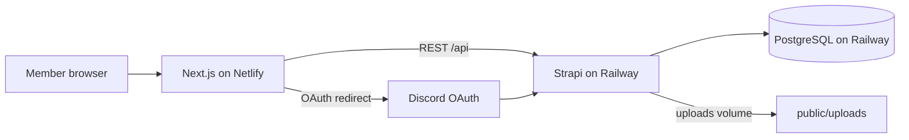

# Architecture

## Overview



| Layer | Technology | Hosting |
|-------|------------|---------|
| Frontend | Next.js 16 (App Router) | [Netlify](https://www.netlify.com) |
| CMS / API | Strapi 5 | [Railway](https://railway.app) |
| Database | PostgreSQL | Railway (attached to project) |
| Auth | Discord OAuth via Strapi Users & Permissions | Discord Developer Portal |
| Media | Strapi local upload provider | Railway **volume** (see [railway-storage.md](./railway-storage.md)) |

## Repository layout

```
FF-ContentHub/
├── frontend/          # Next.js member portal
├── backend/           # Strapi CMS + REST API
├── docs/              # Project documentation (this folder)
├── netlify.toml       # Netlify build (base: frontend)
├── scripts/           # Shared utilities (e.g. generate Strapi secrets)
└── README.md          # Project entry point
```

## Request flow

1. User opens the Netlify site (custom domain or `*.netlify.app`).
2. Middleware checks auth (JWT in browser storage, or dev bypass).
3. Pages fetch **published** content from Strapi using **Public** role permissions (no user JWT on CMS reads).
4. Login: frontend redirects to `STRAPI_URL/api/connect/discord` → Discord → Strapi callback → frontend `/connect/discord/redirect` stores JWT.

## Design link

[Figma – FeedForward Content Hub](https://www.figma.com/design/8f632doPqtWWNU2xMnS2n3/FeedForward-Content-Hub?node-id=8-3770)
